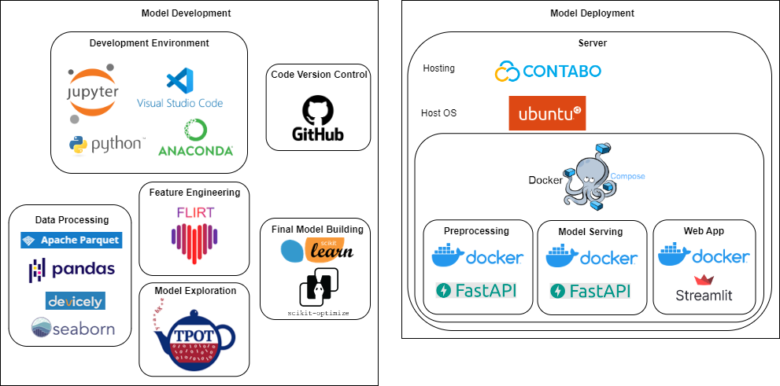

# Stress Detection

This project detects stress from sensor data from [Empatica E4](https://www.empatica.com/en-eu/research/e4/) wrist bands.

You probably want to check out the **interactive live web app** showcasing the whole project: http://5.189.182.28:8003/

You can also check out a [presentation slides](https://docs.google.com/presentation/d/1jYoSlDwUnzAsbdbXSUTaDwHXt9nIfGFa).

You can also check out our [related publication](https://beierle.de/wp-content/papercite-data/pdf/beierle2023csce.pdf).

[](http://5.189.182.28:8003/)


### MLE Infrastructure




### Deployment

```
git checkout https://github.com/fbeierle/stress-detection.git
cd stress-detection
docker compose up --build
```
Then you can enter the web-app on port 8003. The model is being served at port 8002. The preprocessing endpoint is running on port 8004.